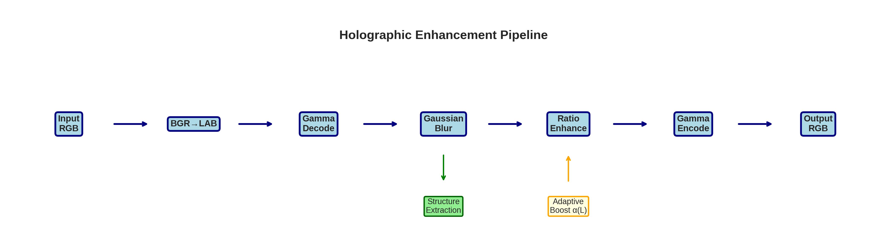

# Holographic Enhancement

[](https://www.gnu.org/licenses/gpl-3.0)
[](https://www.python.org/downloads/)
[](https://developer.nvidia.com/cuda-toolkit)

**A physics-based image and video enhancement algorithm inspired by holographic interference principles.**

<p align="center">
  
</p>

## Overview

This repository implements a novel image enhancement technique that treats pixel intensity as the squared amplitude of a complex wave field—the same mathematical framework used in holography. Unlike conventional sharpening methods that amplify noise or create halos, our approach achieves natural-looking detail enhancement without artifacts.

### Key Features

- 🔬 **Physics-based**: Grounded in wave optics and holographic principles
- 🚀 **Real-time**: CUDA implementation achieves 800+ fps at 1080p
- 🎨 **Color-preserving**: Works in LAB space, modifies only luminance
- 🛡️ **Artifact-free**: No halos, noise amplification, or color shifts
- 📦 **No training required**: Works immediately on any content

## Quick Start

### Python

```bash
pip install numpy scipy opencv-python

# Enhance an image
python src/enhance.py input.jpg output.jpg --boost 1.5

# Enhance a video
python src/enhance.py input.mp4 output.mp4 --boost 1.5
```

### CUDA (10-20x faster)

```bash
cd cuda
make
./enhance_video.sh input.mp4 output.mp4 1.5
```

## The Physics

### Holographic Inspiration

In holography, recorded intensity arises from wave interference:

$$I = |R + O|^2 = |R|^2 + |O|^2 + R^{*}O + RO^{*}$$

We observe that natural images have similar structure: a low-frequency **structure** component modulated by high-frequency **detail**. This insight leads to our enhancement model.

### Amplitude Domain Processing

Image intensity relates to wave amplitude by:

$$I = |A|^2 \quad \Rightarrow \quad A = \sqrt{I}$$

Working in the amplitude domain provides natural dynamic range compression and prevents extreme values.

### The Enhancement Equation

We decompose the image and apply ratio-based enhancement:

$$I_{\text{enhanced}} = I \cdot \left(1 + \beta \cdot \alpha(L) \cdot \frac{I - I_{\text{blur}}}{I_{\text{blur}} + \epsilon}\right)$$

Where:
- $\beta$ = boost strength (typically 1.3-1.5)
- $\alpha(L)$ = adaptive weight protecting shadows/highlights
- $I_{\text{blur}}$ = Gaussian-smoothed structure
- $\epsilon$ = stability constant

See [docs/THEORY.md](docs/THEORY.md) for complete mathematical derivation.

## Results

### Visual Quality

| Artifact | Unsharp Mask | Our Method |
|----------|:------------:|:----------:|
| Edge halos | ❌ | ✅ |
| Noise amplification | ❌ | ✅ |
| Color shifts | ❌ | ✅ |
| Shadow crushing | ❌ | ✅ |

### Performance

| Resolution | Python (fps) | CUDA (fps) | Speedup |
|------------|-------------:|----------:|--------:|
| 720p | 120 | 1,847 | 15× |
| 1080p | 70 | 823 | 12× |
| 4K | 20 | 206 | 10× |

*Benchmarked on NVIDIA RTX 3080*

## Installation

### Requirements

- Python 3.8+
- NumPy, SciPy, OpenCV
- (Optional) CUDA Toolkit 11.0+ for GPU acceleration
- (Optional) FFmpeg for video processing

### From Source

```bash
git clone https://github.com/lostdemeter/holographic_enhancement.git
cd holographic_enhancement
pip install -r requirements.txt

# Build CUDA version (optional)
cd cuda && make
```

## Usage

### Python API

```python
from src.enhance import holographic_enhance
import cv2

# Load image
image = cv2.imread('input.jpg')

# Enhance with default parameters
enhanced = holographic_enhance(image, sigma=2.0, boost=1.5)

# Save result
cv2.imwrite('output.jpg', enhanced)
```

### Command Line

```bash
# Image enhancement
python src/enhance.py photo.jpg photo_enhanced.jpg

# Video enhancement (preserves audio)
python src/enhance.py video.mp4 video_enhanced.mp4

# Custom parameters
python src/enhance.py input.jpg output.jpg --sigma 2.5 --boost 1.3
```

### CUDA Command Line

```bash
# Video enhancement (fastest)
./cuda/enhance_video.sh input.mp4 output.mp4 1.5
```

## Algorithm Details

### Pipeline

```
Input RGB → LAB → Gamma Decode → Blur → Enhance → Gamma Encode → LAB → Output RGB
```

1. **Color Space Conversion**: RGB → CIE LAB (separates luminance from color)
2. **Gamma Decoding**: Convert perceptual values to linear light intensity
3. **Structure Extraction**: Gaussian blur to get low-frequency component
4. **Ratio Enhancement**: Boost detail proportional to local structure
5. **Adaptive Weighting**: Protect shadows and highlights
6. **Gamma Encoding**: Convert back to perceptual space
7. **Color Recombination**: Merge enhanced L with original a, b

### Parameters

| Parameter | Default | Range | Description |
|-----------|---------|-------|-------------|
| `sigma` | 2.0 | 1.0-5.0 | Blur scale (larger = coarser detail) |
| `boost` | 1.5 | 1.0-2.0 | Enhancement strength |

## Documentation

- [**THEORY.md**](docs/THEORY.md) - Complete mathematical foundation
- [**IMPLEMENTATION.md**](docs/IMPLEMENTATION.md) - Implementation details
- [**CUDA.md**](docs/CUDA.md) - GPU optimization guide

## Examples

See the [examples/](examples/) directory for:
- Before/after comparisons
- Parameter tuning guide
- Video processing scripts

## Citation

If you use this work in your research, please cite:

```bibtex
@software{holographic_enhancement,
  title = {Holographic Enhancement: Physics-Based Image Quality Improvement},
  author = {Gushurst, Lesley},
  year = {2024},
  url = {https://github.com/lostdemeter/holographic_enhancement}
}
```

## License

This project is licensed under the GNU General Public License v3.0 - see [LICENSE](LICENSE) for details.

## Author

**Lesley Gushurst** - [lostdemeter](https://github.com/lostdemeter)

## Acknowledgments

This work draws inspiration from:
- Gabor's holographic principles (1948)
- CIE LAB color space research
- GPU computing advances in image processing

